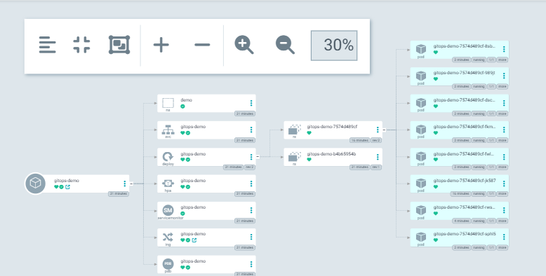
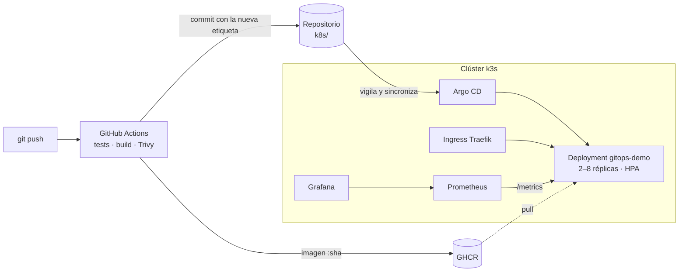
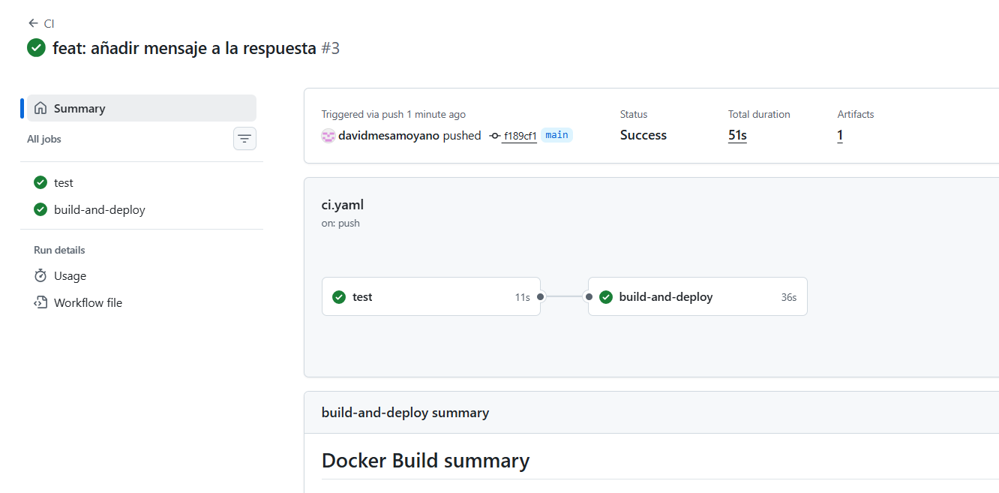
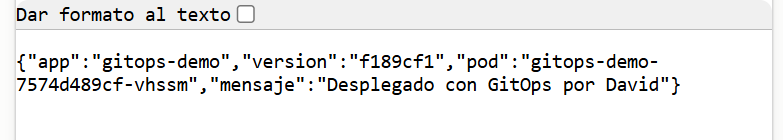
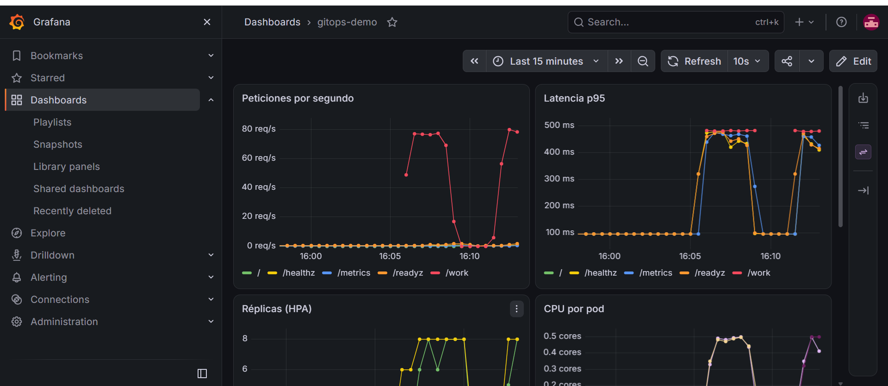

# GitOps en Kubernetes: de `git push` a producción con autoescalado y observabilidad

Plataforma completa sobre **Kubernetes (k3s)** en la que un `git push` basta para llevar el código a producción. Por el camino:

- se pasan los **tests**;
- se construye una **imagen Docker**;
- se **escanea** en busca de vulnerabilidades;
- **Argo CD** despliega la nueva versión **sin cortes de servicio**.

Una vez desplegada, la aplicación **escala sola** según la carga (HPA) y se **monitoriza** con Prometheus y Grafana.



## Arquitectura



## Qué demuestra

| Área | Implementación |
|---|---|
| **CI/CD** | GitHub Actions: tests con pytest, build multietapa, push a GHCR y etiquetado por SHA del commit (nunca `latest`) |
| **GitOps** | Argo CD con `automated`, `selfHeal` y `prune`: Git es la única fuente de verdad |
| **Kubernetes** | Deployment, Service, Ingress, HPA, PodDisruptionBudget, probes, requests y limits, Kustomize |
| **Seguridad** | Contenedor sin root, sistema de archivos de solo lectura, sin capabilities, seccomp `RuntimeDefault` y escaneo con Trivy |
| **Observabilidad** | Métricas Prometheus en la app, ServiceMonitor y dashboard de Grafana versionado como código |
| **Fiabilidad** | Rolling update sin cortes (`maxUnavailable: 0` y readinessProbe), autorreparación y autoescalado de 2 a 8 réplicas |

## Resultados

### 1. De `git push` a producción sin tocar el clúster
Un cambio en `app/main.py` pasa el pipeline en menos de un minuto. El bot hace commit de la nueva etiqueta en `k8s/kustomization.yaml` y Argo CD despliega la versión con un rolling update.




### 2. Autoescalado bajo carga
Un Job genera 3 minutos de carga contra `/work`, un endpoint que consume CPU. Con la CPU al 500 % del objetivo, el HPA escala de **2 a 8 réplicas** en menos de un minuto, y vuelve a 2 cuando termina la carga.



### 3. Autorreparación
Borrar a mano un recurso del clúster (`kubectl delete hpa gitops-demo`) no sirve de nada: Argo CD detecta la desviación respecto a Git y lo recrea en segundos.

## Problemas encontrados y cómo los resolví

**El autoescalado no funcionaba con GitOps.** Con la CPU al 486 %, el HPA seguía en 2 réplicas. El Deployment declaraba `replicas: 2`, así que cada vez que el HPA escalaba, Argo CD (con `selfHeal`) lo detectaba como desviación respecto a Git y lo revertía. El panel de réplicas de Grafana muestra la pelea: las réplicas deseadas en 8 y las reales oscilando. **Solución:** quitar `replicas` del Deployment y dejar que el HPA (`minReplicas: 2`) sea el único dueño de ese campo.

**Más réplicas no siempre significa más capacidad.** Con 8 réplicas, el throughput se mantuvo en unas 80 peticiones por segundo, porque todos los pods comparten un único nodo de 4 vCPU que ya estaba saturado. En un clúster real, el siguiente paso sería un *Cluster Autoscaler* que añada nodos.

**La instalación de Argo CD fallaba con `kubectl apply`.** El CRD de `ApplicationSet` supera el límite de 256 KB de la anotación `last-applied-configuration`. **Solución:** instalar con `kubectl apply --server-side`.

**Versión inexistente de una GitHub Action.** El pipeline fallaba en *Set up job* porque las etiquetas de `trivy-action` usan el prefijo `v`. Lo detecté en los logs y lo corregí fijando `@v0.36.0`.

## Estructura

```
app/                 API en Python (FastAPI) con /metrics, tests y Dockerfile
k8s/                 Manifiestos de la app (Kustomize): lo que Argo CD despliega
argocd/              Definición de la Application de Argo CD
platform/            Scripts de instalación del clúster, Argo CD y monitorización
loadtest/            Job de carga para disparar el autoescalado
.github/workflows/   Pipeline de CI/CD
docs/                Capturas
```

## Cómo reproducirlo

Requisitos: una VM Ubuntu Server (4 vCPU, 8 GB de RAM, red en modo puente) y una cuenta de GitHub.

1. **Haz un fork del repositorio** y configúralo. Pon el paquete de GHCR en *Public* tras la primera ejecución del pipeline.
   ```bash
   bash platform/00-configure.sh <usuario-github> <ip-vm>
   git commit -am "config" && git push
   ```
2. **En la VM**, instala el clúster y la monitorización:
   ```bash
   git clone https://github.com/<usuario-github>/gitops-k8s-platform.git && cd gitops-k8s-platform
   bash platform/01-install-k3s.sh && source ~/.bashrc
   bash platform/03-install-monitoring.sh
   ```
3. **Instala Argo CD** y registra la aplicación:
   ```bash
   bash platform/02-install-argocd.sh
   kubectl apply -f argocd/application.yaml
   ```
4. **Accede a los servicios:**
   - App: `http://demo.<ip-vm>.nip.io`
   - Grafana: `kubectl -n monitoring port-forward svc/monitoring-grafana 3000:80 --address 0.0.0.0`
   - Argo CD: `kubectl -n argocd port-forward svc/argocd-server 8080:443 --address 0.0.0.0`
5. **Lanza la prueba de carga:**
   ```bash
   kubectl apply -f loadtest/load-job.yaml && kubectl -n demo get hpa -w
   ```

## Próximas mejoras

- TLS con cert-manager.
- Alertas en Alertmanager.
- Entornos `staging` y `prod` con overlays de Kustomize.
- Helm chart propio.
- Despliegue en un clúster gestionado (EKS, AKS o GKE) con Terraform.

## Autor

**David Mesa Moyano**, Ingeniero Superior de Telecomunicación (UPV)
david_mes@outlook.com · [LinkedIn](https://www.linkedin.com/in/)
