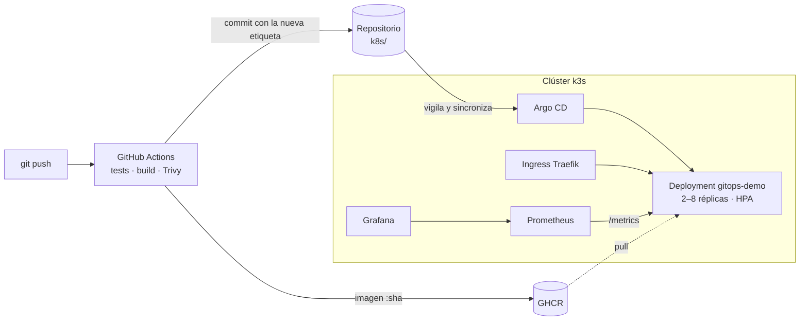

# GitOps en Kubernetes: de `git push` a producción con autoescalado y observabilidad

Este proyecto es una plataforma completa sobre **Kubernetes (k3s)**. Cada `git push` hace lo siguiente sin que nadie toque el clúster:

1. Pasa los **tests**.
2. Construye una **imagen Docker** y la sube a GitHub Container Registry.
3. **Escanea vulnerabilidades** con Trivy.
4. **Argo CD** la despliega en el clúster.

Una vez desplegada, la aplicación **escala sola** con la carga (HPA) y se **monitoriza** con Prometheus y Grafana.



## Qué demuestra

| Área | Cómo |
|---|---|
| CI/CD | GitHub Actions: tests con pytest, build multietapa, push a GHCR y etiquetas por SHA del commit |
| GitOps | Argo CD con `selfHeal` y `prune`: Git es la única fuente de verdad, y un cambio manual con kubectl se revierte solo |
| Kubernetes | Deployment, Service, Ingress, HPA, PodDisruptionBudget, probes, requests y limits, Kustomize |
| Seguridad | Contenedor sin root, sistema de archivos de solo lectura, sin capabilities, seccomp y escaneo con Trivy |
| Observabilidad | Métricas Prometheus en la app, ServiceMonitor y dashboard de Grafana versionado como código |
| Fiabilidad | Rolling update sin cortes (`maxUnavailable: 0`), rollback con Git y autoescalado bajo carga |

## Estructura

```
app/                 API en Python (FastAPI) con /metrics, tests y Dockerfile
k8s/                 Manifiestos de la app (Kustomize): lo que Argo CD despliega
argocd/              Definición de la Application de Argo CD
platform/            Scripts de instalación del clúster, Argo CD y monitorización
loadtest/            Job de carga para disparar el autoescalado
.github/workflows/   Pipeline de CI/CD
```

## Puesta en marcha (≈ 4 horas la primera vez)

| Bloque | Tiempo |
|---|---|
| 1. Máquina virtual | 30 min |
| 2. Repositorio y pipeline | 45 min |
| 3. k3s y monitorización | 40 min |
| 4. Argo CD y primer despliegue | 40 min |
| 5. Demostraciones y capturas | 60 min |
| 6. Pulir el README y LinkedIn | 30 min |

### 1. Máquina virtual

1. En VirtualBox crea una VM **Ubuntu Server 24.04** con **4 CPU, 8 GB de RAM y 30 GB de disco**.
2. En Red pon **Adaptador puente** y marca *Install OpenSSH server* durante la instalación.
3. Dentro de la VM, apunta su IP con `ip -4 addr` (por ejemplo, 192.168.1.50). Es la `IP_VM`.

### 2. Repositorio y pipeline (desde Windows, con Git Bash)

1. Crea en GitHub un repositorio **público y vacío** llamado `gitops-k8s-platform`.
2. En la carpeta del proyecto, abre **Git Bash** y ejecuta:
   ```bash
   bash platform/00-configure.sh <tu-usuario-github> <IP_VM>
   git init -b main && git add -A && git commit -m "Proyecto GitOps en Kubernetes"
   git remote add origin https://github.com/<tu-usuario-github>/gitops-k8s-platform.git
   git push -u origin main
   ```
3. En la pestaña **Actions** verás pasar los tests, el build, Trivy y el commit automático `deploy: gitops-demo <sha>`. Después, ejecuta `git pull` en Windows para traer ese commit.
4. En GitHub, ve a **Packages → gitops-k8s-platform → Package settings** y cambia la visibilidad a **Public**, para que el clúster pueda descargar la imagen sin credenciales.

A partir de aquí, los cambios de código los haces en Windows (VS Code) y los subes con `git push`. La VM solo lee el repositorio.

### 3. k3s y monitorización (en la VM)

Desde PowerShell, entra en la VM con `ssh usuario@IP_VM` y ejecuta:

```bash
sudo apt update && sudo apt install -y git
git clone https://github.com/<tu-usuario-github>/gitops-k8s-platform.git && cd gitops-k8s-platform
bash platform/01-install-k3s.sh && source ~/.bashrc
bash platform/03-install-monitoring.sh     # antes de Argo CD: instala el tipo ServiceMonitor
kubectl -n monitoring port-forward svc/monitoring-grafana 3000:80 --address 0.0.0.0 &
```

Grafana estará en `http://IP_VM:3000`.

### 4. Argo CD y primer despliegue

```bash
bash platform/02-install-argocd.sh
kubectl apply -f argocd/application.yaml
kubectl -n argocd port-forward svc/argocd-server 8080:443 --address 0.0.0.0 &
kubectl -n demo get pods,hpa,ingress
```

Comprueba que todo responde:

- Argo CD en `https://IP_VM:8080`.
- La app en `http://demo.IP_VM.nip.io`.
- El dashboard *gitops-demo* en Grafana.

### 5. Demostraciones (haz capturas o un GIF de cada una para el README)

1. **GitOps de extremo a extremo.** Cambia el mensaje de `root()` en `app/main.py` y haz push. Sin tocar el clúster, en unos minutos `http://demo.IP_VM.nip.io` muestra la nueva `version`. Argo CD enseña el historial de despliegues.
2. **Autoescalado.**
   ```bash
   kubectl apply -f loadtest/load-job.yaml
   kubectl -n demo get hpa -w
   ```
   Verás cómo pasa de 2 a varias réplicas, y en Grafana suben a la vez las peticiones, la CPU y las réplicas. Cuando acaba la carga, vuelve a 2.
3. **Autorreparación (selfHeal).** Ejecuta `kubectl -n demo scale deploy gitops-demo --replicas=1`. Argo CD detecta la desviación respecto a Git y la deshace.
4. **Rollback con Git.** Haz `git revert` del último commit `deploy:` y push. Argo CD vuelve a la versión anterior.
5. **Actualización sin cortes.** Durante un despliegue, deja esto en otra terminal: `while true; do curl -s -o /dev/null -w "%{http_code}\n" http://demo.IP_VM.nip.io; sleep 0.2; done`. No debe aparecer ningún error.

## Próximas mejoras

- Helm chart propio en lugar de Kustomize.
- TLS con cert-manager.
- Alertas en Alertmanager.
- Entornos `staging` y `prod` con overlays.
- Desplegar el mismo repositorio en un clúster gestionado (EKS, AKS o GKE) con Terraform.

## Autor

**David Mesa Moyano**, Ingeniero Superior de Telecomunicación (UPV) · david_mes@outlook.com
